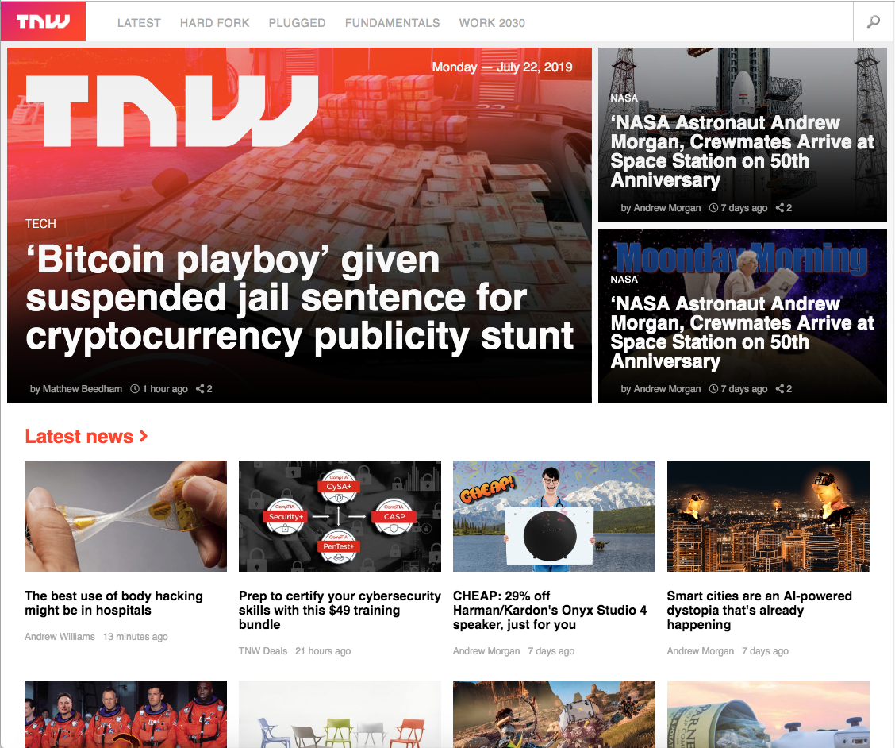

Microverse curiculum 6th collaborative project

# Building with Responsive Design

## Responsive-Design

In this project, we built a responsive website. We cloned the https://thenextweb.com/ , a tech-focused magazine which uses media queries to gracefully degrade their site as the window size is reduced.

Used:

- HTML5
- CSS FlexBox
- CSS Grid

## Authors

- Neto Daniel Zinga https://github.com/dannyclever
- Nick Haralampopoulos https://github.com/macnick

## Screenshot

## The Website

Follow the link to acess to the Website: https://dannyclever.github.io/Responsive-Design/
